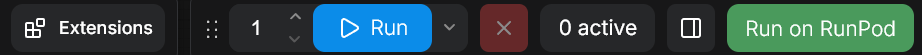

# ComfyUI-RunOnRunpod

A ComfyUI plugin that lets you run workflows on [RunPod Serverless](https://www.runpod.io/product/serverless). Adds a "Run on RunPod" button to the UI that submits the current workflow to your RunPod endpoint and shows results.



## Components

### Plugin (ComfyUI custom node)

Installed in your local ComfyUI's `custom_nodes/` directory. Provides:

- **Run on RunPod button** with status indicator (green → yellow → blue → green/red)
- Click the button to cancel a running job
- **Settings panel** for RunPod and storage configuration
- Uploads input files (images, video, audio) to the network volume before submitting
- Automatically uploads missing models (checkpoints, LoRAs, VAEs, text encoders, etc.) to the network volume
- Downloads output files back to your local ComfyUI output directory after job completion
- Optional cleanup of remote inputs and outputs after each job

### Worker (RunPod Serverless)

A Docker image that runs ComfyUI on RunPod. The worker:

- Receives workflow JSON via RunPod job input
- Reads input files and writes output files directly on the mounted network volume
- Requires **zero configuration** — no S3 credentials or environment variables needed
- Uses a RunPod **network volume** for models, inputs, and outputs

## Setup

### 1. Prepare the network volume

Create a RunPod network volume and set up the following directory structure:

```
/models/         # ComfyUI models (checkpoints, loras, etc.)
/inputs/         # Input files (uploaded by the plugin)
/outputs/        # Output files (written by the worker)
```

Models are automatically uploaded to the network volume when you submit a workflow (if "Upload missing models automatically" is enabled). You can also upload models manually using AWS CLI or any S3-compatible client with RunPod's S3 API credentials.

### 2. Prepare the worker

ComfyUI and custom nodes are bundled into the Docker image to minimize cold start times on RunPod Serverless. Without bundling, each cold start would need to install dependencies, adding minutes of delay.

A pre-built image is available at `docker.io/metebalci/comfyui-runonrunpod:latest` with the custom nodes listed in `worker/custom_nodes.txt`.

To build your own image with different custom nodes:

1. Edit `worker/custom_nodes.txt` to list the custom nodes you need (one git URL per line)
2. Build and push:
   ```bash
   cd worker
   docker build -t your-dockerhub-username/comfyui-runonrunpod:latest .
   docker push your-dockerhub-username/comfyui-runonrunpod:latest
   ```

For quick testing, you can install extra custom nodes at startup without rebuilding the image by setting the `EXTRA_CUSTOM_NODES_URL` environment variable to a URL pointing to a text file with git URLs (same format as `custom_nodes.txt`). Nodes already baked into the image are skipped. This adds to cold start time, so for production use, rebuild the image instead.

The Docker image uses prebuilt flash-attn wheels from [mjun0812/flash-attention-prebuild-wheels](https://github.com/mjun0812/flash-attention-prebuild-wheels).

Create a RunPod Serverless endpoint using the image, with the network volume attached.

### 3. Install the plugin

Clone this repo into your ComfyUI custom nodes directory:

```bash
cd ComfyUI/custom_nodes
git clone https://github.com/metebalci/ComfyUI-RunOnRunpod.git
pip install -r ComfyUI-RunOnRunpod/requirements.txt
```

Restart ComfyUI.

**Note:** This plugin requires the new menu (Settings -> "Use new menu" -> "Top"). The legacy menu is not supported.

### 4. Configure

Open ComfyUI Settings and find the **Run on Runpod** section:

**Job:**
- Upload missing models automatically — default on
- Delete inputs from network volume after job — default off
- Delete outputs from network volume after job — default on (outputs are downloaded locally first)

**Keys:**
- API Key — RunPod API key
- S3 Access Key — from RunPod S3 API keys
- S3 Secret Key — from RunPod S3 API keys

**Serverless:**
- Endpoint ID — your RunPod Serverless endpoint ID

**Storage:**
- Bucket Name — your network volume ID
- Region — S3 region (shown on RunPod dashboard, e.g. `eur-is-1`)
- Endpoint URL — RunPod S3 endpoint (region-specific, shown on RunPod dashboard)

## Usage

1. Build your workflow in ComfyUI as usual
2. Click **Run on RunPod**
3. Watch the button color for status:
   - **Yellow** — queued
   - **Blue (pulsing)** — running
   - **Green** — completed
   - **Red** — failed
4. Outputs are automatically downloaded to your local ComfyUI output directory
5. Click the button while a job is running to cancel it

## Storage Architecture

Everything lives on the RunPod network volume:

- **Models** — `/models/` (symlinked to ComfyUI's model path)
- **Inputs** — `/inputs/` (plugin uploads via RunPod S3 API, worker reads as local files)
- **Outputs** — `/outputs/` (worker writes as local files, accessible via RunPod S3 API)

When you submit a job, the plugin scans the workflow for model loader nodes (CheckpointLoader, LoraLoader, VAELoader, CLIPLoader, UNETLoader, ControlNetLoader, etc.) and checks if each model exists on the network volume. Missing models are automatically uploaded from your local ComfyUI models directory. This can be disabled in settings.

Input files are deduplicated using content hashing (SHA-256). Each file is stored as `inputs/{hash}{ext}`, so uploading the same image across multiple jobs skips the upload entirely.

After a job ends (whether it succeeds or fails), the plugin downloads output files to your local ComfyUI output directory. Two cleanup settings control whether remote files are removed from the network volume afterward:

- **Delete inputs after job** (default: off) — keeps deduplicated inputs for reuse across jobs
- **Delete outputs after job** (default: on) — removes remote outputs since they've been downloaded locally

The worker has zero storage configuration — the network volume is mounted locally and it just reads/writes files.

## Troubleshooting

- **Button turns red briefly then back to green** — This can happen if you purge the queue on the RunPod dashboard while a job is running. The plugin detects the job as failed, then recovers to idle. This is normal.

- **Job fails with "400 Bad Request"** — The workflow was rejected by ComfyUI on the worker. The error details (missing nodes, invalid connections, missing models) are shown in the ComfyUI console log. Check which node or model is missing and either add it to the Docker image or upload the model to the network volume.

- **Job stays queued (yellow) for a long time** — No worker is available. Check the RunPod dashboard for throttled workers. If a worker is stuck in "throttled" state, terminate it manually. Consider increasing the idle timeout (30-60s recommended) to avoid throttle/shutdown cycles.

- **Job completes but no output appears locally** — Check the ComfyUI console log for download errors. Common causes: S3 credentials don't have read access, or the output path on the network volume doesn't match what the worker wrote.

- **Missing custom nodes** — If the workflow uses nodes not installed in the worker Docker image, the job will fail with a `prompt_outputs_failed_validation` error listing the unknown node types. Add the missing nodes to `worker/custom_nodes.txt` and rebuild the image.

- **Missing models** — If a model file (checkpoint, LoRA, VAE, text encoder) isn't on the network volume, ComfyUI will reject the workflow with a `value_not_in_list` error. Upload the model to the correct subdirectory under `models/` on the network volume.

## License

GNU General Public License v3.0. See [LICENSE](LICENSE).
