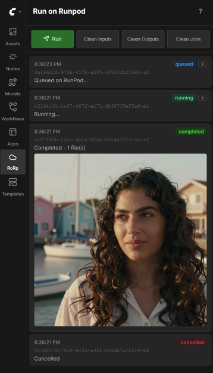

# ComfyUI-RunOnRunpod

A ComfyUI plugin that lets you run workflows on [RunPod Serverless](https://www.runpod.io/product/serverless). Adds a sidebar panel to the UI that submits workflows to your RunPod endpoint and tracks job progress.



## Components

### Plugin (ComfyUI custom node)

Installed in your local ComfyUI's `custom_nodes/` directory. Provides:

- **Sidebar panel** (cloud icon) with Run button and job history
- **Multi-job support** — submit multiple workflows and track each independently
- **Real-time status** via WebSocket — preparing, queued, running, completed, failed
- **Upload progress bar** for model uploads with MB/percentage display
- **Cancel support** — cancel during upload (waits for current file to finish) or while queued/running on RunPod
- **Settings panel** for RunPod and storage configuration
- Uploads input files (images, video, audio) to the network volume before submitting
- Automatically uploads missing models (checkpoints, LoRAs, VAEs, text encoders, etc.) to the network volume
- Downloads output files back to your local ComfyUI output directory after job completion
- Optional cleanup of remote inputs/outputs after each job, plus manual clean buttons
- **Node compatibility check** — before each job, queries the worker for its available nodes and blocks submission if the workflow uses custom nodes not installed on the worker
- **Worker availability check** — waits for a worker to be ready before submitting, handling cold starts gracefully
- **Settings warning** — alerts when required settings are not configured

### Worker (RunPod Serverless)

A Docker image that runs ComfyUI on RunPod. The worker:

- Receives workflow JSON via RunPod job input
- Reads input files and writes output files directly on the mounted network volume
- Requires **zero configuration** — no S3 credentials or environment variables needed
- Uses a RunPod **network volume** for models, inputs, and outputs

## Quickstart

From zero to a first successful run:

1. **Create a network volume** on RunPod. Pick a region that has the GPU availability you want to use — the endpoint in the next step must live in the same region. Note the volume ID. The region and S3 endpoint URL are shown under **Storage → S3 API Access** on the RunPod dashboard.
2. **Create a Serverless endpoint** — type **Queue-based**, image `docker.io/metebalci/comfyui-runonrunpod:latest`, attach the network volume from step 1, set idle timeout to 30–60s. Note the endpoint ID.
3. **Get credentials** from the RunPod dashboard:
   - API key (Settings → API Keys)
   - S3 access key + secret (Storage → S3 API Keys)
   - Region and S3 endpoint URL (Storage → S3 API Access)
4. **Install the plugin** in your local ComfyUI: `comfy node install comfyui-runonrunpod`, then restart ComfyUI.
5. **Configure** in ComfyUI Settings → *Run on Runpod*: paste the API key, S3 keys, endpoint ID, bucket name (= volume ID), region, and endpoint URL.
6. **Open a workflow** — the Z-Image workflow from the ComfyUI tutorials is a good starting point, but any workflow will do.
7. **Download the required models locally** into your local ComfyUI `models/` directory. The plugin uploads models to the network volume on demand by reading them from your local ComfyUI install — if a model isn't present locally, the plugin can't upload it and the job will fail.
8. **Run** — open the Run on Runpod sidebar (cloud icon) and click **Run**. The plugin uploads any missing models/inputs, submits to RunPod, and downloads outputs back to your local `output/` when the job finishes.

See [Setup](#setup) below for more detail on each step, including building a custom worker image.

## Setup

### 1. Prepare the network volume

Create a RunPod network volume and set up the following directory structure:

```
/models/         # ComfyUI models (checkpoints, loras, etc.)
/inputs/         # Input files (uploaded by the plugin)
/outputs/        # Output files (written by the worker)
```

Models are automatically uploaded to the network volume when you submit a workflow (if "Upload missing models automatically" is enabled). You can also upload models manually using AWS CLI or any S3-compatible client with RunPod's S3 API credentials.

### 2. Prepare the worker

ComfyUI and custom nodes are bundled into the Docker image to minimize cold start times on RunPod Serverless. Without bundling, each cold start would need to install dependencies, adding minutes of delay.

A pre-built image is available at `docker.io/metebalci/comfyui-runonrunpod:latest` with the custom nodes listed in `worker/custom_nodes.txt`.

To build your own image with different custom nodes:

1. Edit `worker/custom_nodes.txt` to list the custom nodes you need (one git URL per line)
2. Build and push:
   ```bash
   cd worker
   docker build -t your-dockerhub-username/comfyui-runonrunpod:latest .
   docker push your-dockerhub-username/comfyui-runonrunpod:latest
   ```

For quick testing, you can install extra custom nodes at startup without rebuilding the image by setting the `EXTRA_CUSTOM_NODES_URL` environment variable to a URL pointing to a text file with git URLs (same format as `custom_nodes.txt`). Nodes already baked into the image are skipped. This adds to cold start time, so for production use, rebuild the image instead.

The Docker image uses prebuilt flash-attn wheels from [mjun0812/flash-attention-prebuild-wheels](https://github.com/mjun0812/flash-attention-prebuild-wheels).

Create a RunPod Serverless endpoint using the image, with the network volume attached. The endpoint must be a **Queue-based** endpoint — the plugin submits jobs via RunPod's `/run` async API and polls `/status/{job_id}`, which is only supported on queue-based endpoints (not load-balanced ones).

### 3. Install the plugin

**From the ComfyUI Registry:**

```bash
comfy node install comfyui-runonrunpod
```

Or install via ComfyUI Manager by searching for "Run on RunPod".

**Manual install:**

```bash
cd ComfyUI/custom_nodes
git clone https://github.com/metebalci/ComfyUI-RunOnRunpod.git
pip install -r ComfyUI-RunOnRunpod/requirements.txt
```

Restart ComfyUI.

### 4. Configure

Open ComfyUI Settings and find the **Run on Runpod** section:

**Job:**
- Upload missing models automatically — default on
- Download from the source when possible — default off (see Storage Architecture)
- Delete inputs from network volume after job — default off
- Delete outputs from network volume after job — default on (outputs are downloaded locally first)

**Keys:**
- API Key — RunPod API key
- S3 Access Key — from RunPod S3 API keys
- S3 Secret Key — from RunPod S3 API keys
- CivitAI API Key — optional, used only with "Download from the source" for authenticated CivitAI downloads
- HuggingFace Token — optional, used only with "Download from the source" for gated/private HuggingFace repos

**Serverless:**
- Endpoint ID — your RunPod Serverless endpoint ID

**Storage:**
- Bucket Name — your network volume ID
- Region — S3 region (shown on RunPod dashboard, e.g. `eur-is-1`)
- Endpoint URL — RunPod S3 endpoint (region-specific, shown on RunPod dashboard)

## Usage

1. Build your workflow in ComfyUI as usual
2. Open the **Run on Runpod** sidebar panel (cloud icon on the left)
3. Click **Run** to submit the workflow
4. Track progress in the job list:
   - **preparing** — validating credentials, waiting for worker, checking custom nodes, uploading models/inputs
   - **queued** — waiting for a RunPod worker
   - **running** — workflow is executing
   - **completed** — outputs downloaded to your local ComfyUI output directory
   - **failed** — check the error message on the job card
5. Click **X** on a job card to cancel it
6. Use **Clean Inputs** / **Clean Outputs** to remove files from the network volume
7. Use **Clean Jobs** to clear finished jobs from the list

## Storage Architecture

Everything lives on the RunPod network volume:

- **Models** — `/models/` (symlinked to ComfyUI's model path)
- **Inputs** — `/inputs/` (plugin uploads via RunPod S3 API, worker reads as local files)
- **Outputs** — `/outputs/` (worker writes as local files, accessible via RunPod S3 API)

When you submit a job, the plugin scans the workflow for model loader nodes (CheckpointLoader, LoraLoader, VAELoader, CLIPLoader, UNETLoader, ControlNetLoader, etc.) and checks if each model exists on the network volume. Missing models are automatically uploaded from your local ComfyUI models directory. This can be disabled in settings.

**Download from the source (optional, opt-in).** For very large models, uploading from a home connection is the slow part of the first run. With the **Download from the source when possible** setting enabled, the plugin tries to find a remote source for each missing model and has the worker fetch it directly onto the network volume over the datacenter's much faster connection. Lookup order:

1. **ComfyUI-Manager model database** — filename match against Manager's curated `model-list.json`. No external calls per model; the database itself is fetched once per 24h from GitHub.
2. **HuggingFace cache reverse-lookup** — if a model resolves to a file inside your local `~/.cache/huggingface/hub/`, the plugin recovers the repo ID and asks the worker to re-download from HuggingFace. Local filesystem only, no network calls for the lookup.
3. **CivitAI by hash** — the plugin hashes the local file and queries CivitAI's `by-hash` API. This is the only step that sends data externally: the SHA-256 of the file is sent to CivitAI to identify the model.
4. **Fallback** — any model the lookup chain can't resolve is uploaded from your local file the normal way.

If the worker fails to download a file (404, network error, hash mismatch), it reports the failure back and the plugin falls back to uploading that specific file locally — the feature is purely a performance improvement, never a single point of failure. Gated HuggingFace repos or authenticated CivitAI downloads can be unlocked by configuring **HuggingFace Token** and **CivitAI API Key** in the Keys section.

Input files are deduplicated using content hashing (SHA-256). Each file is stored as `inputs/{hash}{ext}`, so uploading the same image across multiple jobs skips the upload entirely.

After a job ends (whether it succeeds or fails), the plugin downloads output files to your local ComfyUI output directory. Two cleanup settings control whether remote files are removed from the network volume afterward:

- **Delete inputs after job** (default: off) — keeps deduplicated inputs for reuse across jobs
- **Delete outputs after job** (default: on) — removes remote outputs since they've been downloaded locally

The worker has zero storage configuration — the network volume is mounted locally and it just reads/writes files.

## Troubleshooting

- **Job fails with "400 Bad Request"** — The workflow was rejected by ComfyUI on the worker. The error details (missing nodes, invalid connections, missing models) are shown in the ComfyUI console log. Check which node or model is missing and either add it to the Docker image or upload the model to the network volume.

- **Job stays queued for a long time** — No worker is available. Check the RunPod dashboard for throttled workers. If a worker is stuck in "throttled" state, terminate it manually. Consider increasing the idle timeout (30-60s recommended) to avoid throttle/shutdown cycles.

- **Job completes but no output appears locally** — Check the ComfyUI console log for download errors. Common causes: S3 credentials don't have read access, or the output path on the network volume doesn't match what the worker wrote.

- **Missing custom nodes** — The plugin checks node compatibility before each submission. If your workflow uses nodes not available on the worker, the job card will show a failed status listing the missing nodes. Add the missing nodes to `worker/custom_nodes.txt` and rebuild the image.

- **Missing models** — If a model file (checkpoint, LoRA, VAE, text encoder) isn't on the network volume, ComfyUI will reject the workflow with a `value_not_in_list` error. Upload the model to the correct subdirectory under `models/` on the network volume.

## License

GNU General Public License v3.0. See [LICENSE](LICENSE).
